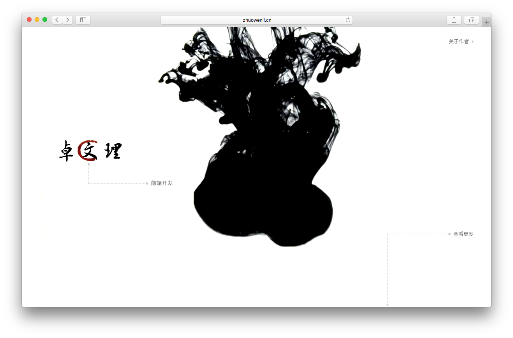

## 博客3.0

正在开发中...

## TODO LIST

- 服务端开发
    - [x] 技术选型
    - [x] 架构设计
    - [x] 数据结构
    - [x] API设计
- 前台开发
    - [x] 技术选型
    - [x] 架构设计
    - [x] 路由机制
    - [x] 构建流程
    - [x] 侧栏交互
    - [x] 首页
    - [x] 文章列表
    - [x] 文章详情
    - [ ] 关于
    - [ ] 搜索页
- 后台开发
    - [x] 技术选型
    - [x] 架构设计
    - [x] 路由机制
    - [x] 构建流程
    - [x] 文章列表
    - [x] 文章编辑
    - [ ] 标签管理
    - [ ] 分类管理



## 技术栈

- 后端：Node.js + koa + MySQL + knex
- 前端：Vue.js + Vue Router + Webpack + ES2015

## Quick Start

1. 安装 Homebrew

    ```
    /usr/bin/ruby -e "$(curl -fsSL https://raw.githubusercontent.com/Homebrew/install/master/install)"
    ```

2. 安装 `node` 要求至少 `6.0.0` 以上版本

    ```
    brew install node
    ```

3. 安装 `cnpm` 镜像加速，`npm` 国内访问太慢

    ```
    npm install -g cnpm --registry=https://registry.npm.taobao.org
    ```

4. 安装全局 `npm` 依赖

    可以使用 `cnpm info knex` 查看各个包的详细信息

    ```
    cnpm i -g knex nodemon babel babel-eslint
    // 各模块说明
    // knex - SQL 构造器以及数据库迁移工具
    // nodemon - node 调试工具，用于代码改变后自动重启服务
    // balbel, balbel-eslint 用于 ES2015 语法兼容，用于 IDE 语法查错等
    ```

5. 安装项目依赖

    ```
    cnpm i
    ```

6. 创建项目配置

    可以根据自己机器适当修改配置，例如数据库端口、密码等

    ```
    cp .env.example .env
    ```

7. 初始化数据库

    执行此操作前请确认自己机器数据库服务已正常运行，
    另外由于 `bookshelf` 默认采用 JSON 标准格式存储日期，如果使用 mysql 请关闭严格模式：

    - https://github.com/TryGhost/Ghost/issues/5050#issuecomment-83613536
    - http://dba.stackexchange.com/questions/48704/mysql-5-6-datetime-incorrect-datetime-value-2013-08-25t1700000000-with-er

    ```
    // 表结构
    knex migrate:latest

    // 初始数据
    knex seed:run

    // 更多用法参见 `knex -h`
    ```

8. Nginx 配置

    如果需要可以参考项目 `nginx.conf.example`

9. 启动项目

    ```
    npm run dev // dev 环境
    npm start // 线上环境
    ```

## Node.js 基础类库 （按重要级排序）

在开始之前，你至少需要熟悉 `node` 的一些内置的类库，
例如：`Buffer`，`File System`，`Path`，`URL`，`HTTP`，`Process`，`Utilities`，`Events`

http://nodejs.org/api

**以下类库为基础类库，建议把文档看完再开始**

1. bluebird - Promise A+ 规范实现类库，一个通用的异步编程规范

    http://bluebirdjs.com/docs/api-reference.html

2. co - koa 底层类库，基于 ES6 特性实现同步式异步编程

    https://github.com/tj/co

3. knex - 一个 SQL 构造器，`bookshelfjs` 基础支撑

    http://knexjs.org/

4. bookshelf - 一个不错的 ORM

    http://bookshelfjs.org/

## WEB 服务

**koa 库为主框架，同样建议把文档看完再开始**

1. koa - next generation web framework for node.js

    官网：http://koajs.com/
    官网翻译：http://koa.bootcss.com/
    中文指南：https://github.com/guo-yu/koa-guide

2. koa 基础依赖

    以下为列举的一些常用中间件，需要其他可以上 Github 搜索
    https://github.com/koajs/

    - koa-compose 中间键分发，用于多个域名等情况
    - koa-onerror 统一错误处理
    - koa-compress 内容压缩 gzip 等
    - koa-router 路由，此中间件非官方，但是比官方好用
    - koa-bodyparser 请求内容解析，自动根据 content-type 解析 json 或者 www-url-encode
    - koa-session
    - koa-passport 一个基于 `Passport` 的身份管理库

3. 缓存相关

    - co-redis
    - then-redis

