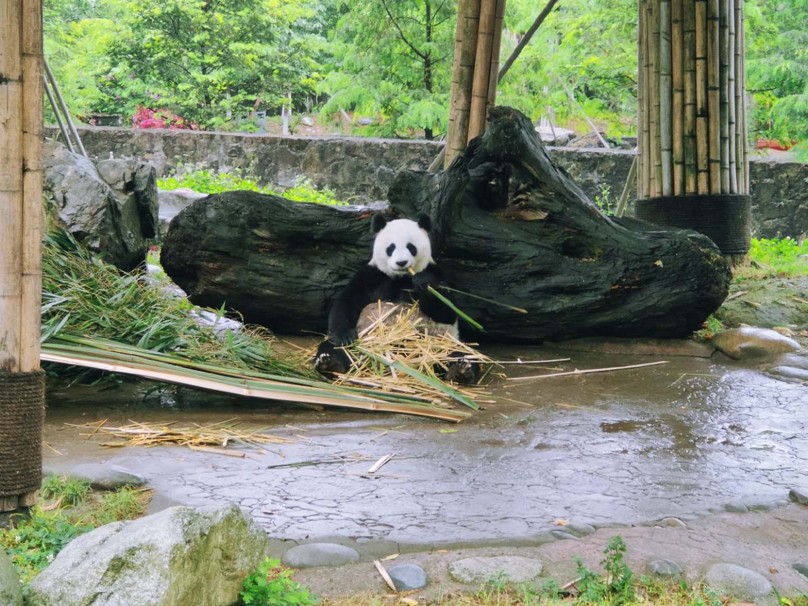
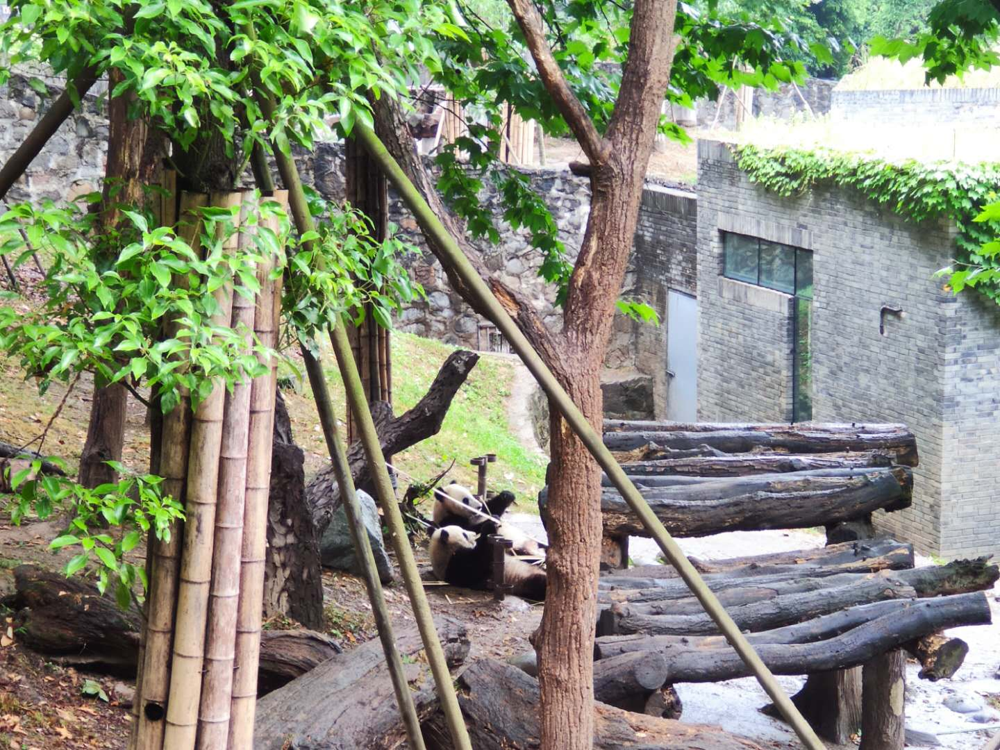
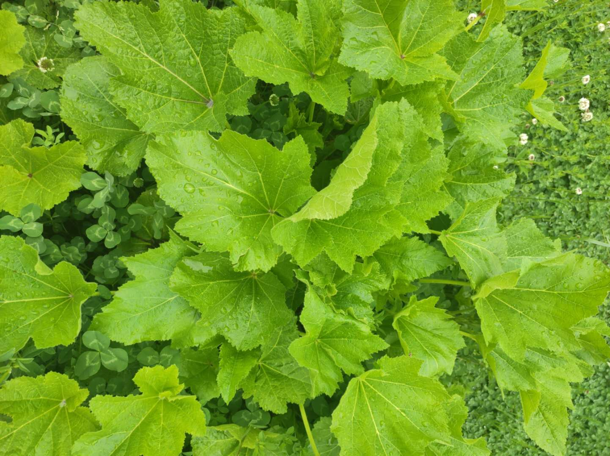
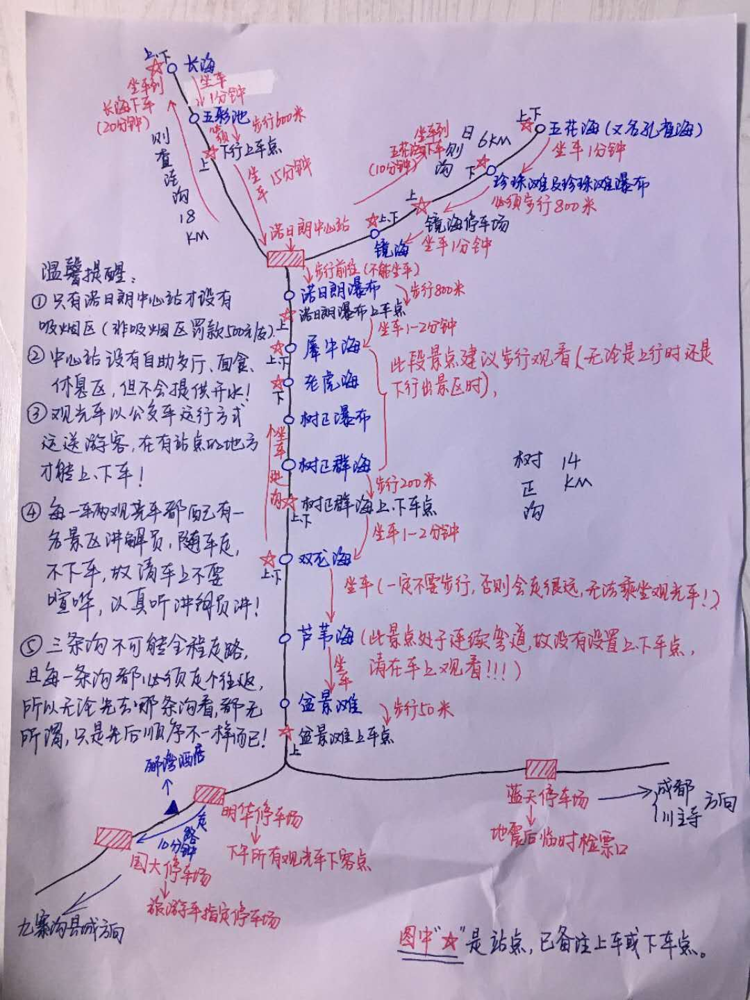
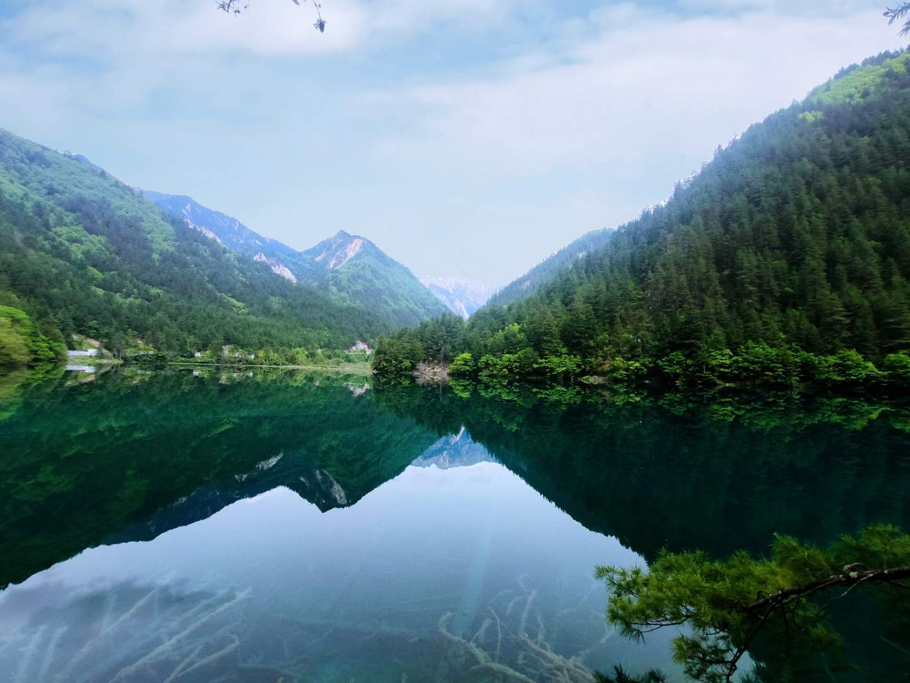
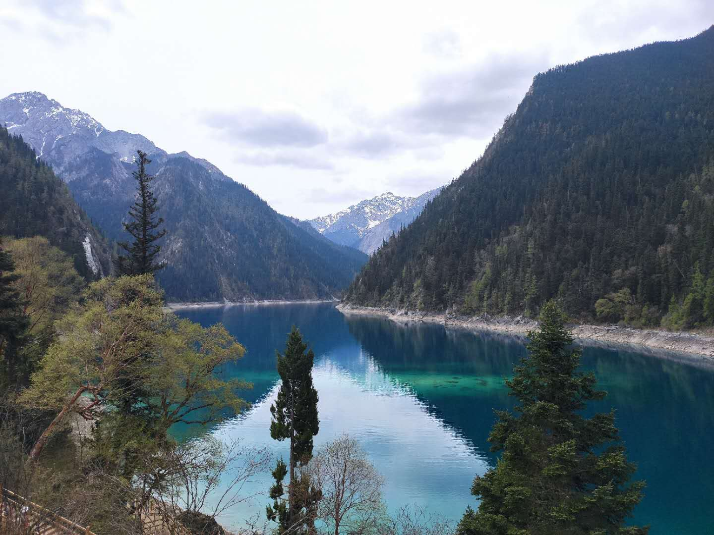

2020 转眼过去一半，我跟野良突然很想去外面看看 :)

<!-- more -->

## 起步

九寨沟地处阿坝藏族羌族自治州的最北面，离成都市区有 400 多公里，全程来回得有 900 多公里，路上需要花费 10 几个小时的时间。所以交通不便是一个很大的问题，我们就直接在飞猪上找旅行社预定一个包车包酒店的行程。

因为疫情缘故，旅行社的门票还挺便宜的，包含两晚希尔顿的酒店，三天两夜的纯玩团票价只要 1500 左右。行程的话是：成都出发 -> 熊猫乐园 -> 九寨沟 -> 黄龙 -> 返回成都。

## 熊猫乐园

第一天的行程是从成都出发，上了旅游大巴后，第一站就到都江堰

熊猫乐园的大熊猫基本上都是成年熊猫，这时候大熊猫领地意识比较强，成年后就开始独居生活了。每只大熊猫都能享受着独栋别墅以及小花园的待遇，就问你羡不羡慕？

## 松州古城

途径松州古城时，下车休息并拍了几张照片。我们对古城墙之类的都不怎么感兴趣，在外面走了一圈就回来了，沿途到是拍了些花花草草。

## 九寨沟

九寨沟的主沟长 30 多公里，为了让大家有更好的游览体验，景区特地设置了观光公交，各个景点之间有公交站点。导游在车上就给我们发了九寨沟的地图，还有凭她经验手绘的路线图，让我们通过结合景区观光车+步行的游览方式，一日也能逛完九寨沟。

上午行程：

乘坐景区观光车到达游玩的第一站五花海（由于地震的影响，五花海往上就没有开放了），然后乘车🚌前往珍珠滩瀑布。

珍珠滩瀑布因老版《西游记》的拍摄而闻名。

接下来大概步行🚶‍♀️800 米前往镜海停车场乘车🚌前往静海。据导游说没风的静海才有看头，如果起风了就可以选择跳过，今天的天气正好没有风。

参观完静海后，才 10 点多，我们选择继续乘车🚌前往诺日朗服务中心站，然后转乘公交🚌到长海站。

长海是九寨沟最大的海子。参观完长海再步行🚶‍♀️前往五彩池，大概有800多米的下山道。五彩池是九寨沟最小但是颜色最丰富的海子，不过因为淡水期，所以看起来比较小。

参观完五彩池差不多到了吃午饭的时间，这时候可以乘车返回诺日朗服务中心站用餐。

下午行程：
