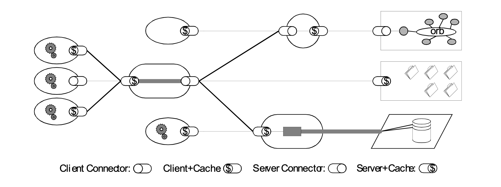

在互联网迅猛发展的今天，作为一名前端开发，大家应该都会经常听到 REST 这个东西。并且随着前后端分离以及开放平台的发展，REST 已经普遍到成为了互联网软件开发者的基本常识。然而，在大部分时候，其实大家都没理解到底什么是 REST。

我最早查阅 REST 资料的时候还是在 15 年刚接触前端开发的时候，就大致粗略的看了一下，觉得没必要花时间看这么简单的东西。对于不理解 REST 的开发人员，人们习惯于展示一些例子代码来让他们理解 REST。如果开发者想要深入理解 REST 是什么，就很难避开 Fielding 的那篇博士论文。然而，当我最近重新去看时论文的时候却颇感吃力。

在当面试官的过程中，我也经常会问一些前端同学：「你知道什么是 REST 吗？」。大家的回答也是五花八门，很少有能够听到让我满意的回答。有的同学说「REST 就是 CRUD」，甚至有的同学说「我没有听说过 REST」！

那么 REST 究竟是什么？RESTful API 跟 REST 有什么区别？是一种技术、一种架构、还是一种规范？

对于这个问题笔者先卖个关子，为了深入理解 REST 是什么，我们需要回顾一下 Web 发展的历程，从源头上讲讲 REST 是怎么来的。

<!-- more -->

## Web 技术发展与 REST 的由来

在互联网行业中，实践总是走在理论之前。Web 发展到了 1995 年，在 CGI、ASP 等技术出现之后，沿用了多年、主要面向静态文档的 HTTP/1.0 协议已经无法满足 Web 应用的开发需求，因此需要设计新版本的 HTTP 协议。

在 HTTP/1.0 协议专家组之中，有一位年轻人脱颖而出，显示出了不凡的洞察力，后来他成为了 HTTP/1.1 协议专家组的负责人。这位年轻人就是 Apache HTTP 服务器的核心开发者 [Roy Fielding](https://en.wikipedia.org/wiki/Roy_Fielding) ，他还是 Apache 软件基金会的合作创始人。

Fielding 和他的同事们在 HTTP/1.1 协议的设计工作中，对于 Web 之所以取得巨大成功，在技术架构方面的因素做了一番深入的总结。Fielding 将这些总结纳入到了一套理论框架之中，然后使用这套理论框架中的指导原则，来指导 HTTP/1.1 协议的设计方向。

HTTP/1.1 协议的第一个草稿是在 1996 年 1 月发布的，经过了三年多时间的修订，于 1999 年 6 月成为了 IETF 的正式规范（包括了 RFC 2616 以及用于对客户端做身份认证的 RFC 2617）。HTTP/1.1 协议设计的极为成功，以至于发布之后整整 10 年时间里，都没有多少人认为有修订的必要。

Fielding 在完成 HTTP/1.1 协议的设计工作之后，回到了加州大学欧文分校继续攻读自己的博士学位。第二年（2000 年）在他的博士学位论文 [Architectural Styles and the Design of Network-based Software Architectures] 中，更为系统、严谨地阐述了这套理论框架，并且使用这套理论框架推导出了一种新的架构风格。Fielding 为这种架构风格取了一个令人轻松愉快的名字「REST」—— Representational State Transfer（表述性状态转移）的缩写。

在我看来，Fielding 这篇博士论文在 Web 发展史上的价值，不亚于 Web 之父 [Tim Berners-Lee](https://www.w3.org/People/Berners-Lee/) 关于超文本的那篇[经典论文](https://www.w3.org/History/1989/proposal.html)。然而遗憾的是，这篇博士论文在诞生之后的将近 5 年时间里，一直没有得到足够的重视。

这种情况在 2005 年之后有了很大的改善，随着 Ajax、Ruby on Rails 等新的 Web 开发技术的兴起，在 Web 开发技术社区掀起了一场重归 Web 架构设计本源的运动，REST 架构风格得到了越来越多的关注。在 2007 年 1 月，支持 REST 开发的 Ruby on Rails 1.2 版正式发布，并且将支持 REST 开发作为 Rails 未来发展中的优先内容。Ruby on Rails 的创始人 [DHH](https://en.wikipedia.org/wiki/David_Heinemeier_Hansson) 做了一个名为「World of Resources」的精彩演讲，DHH 在 Web 开发技术社区中的强大影响力，使得 REST 一下子处在 Web 开发技术舞台的聚光灯之下。

今天，各种流行的 Web 开发框架，几乎没有不支持 REST 开发的。大多数 Web 开发者都是通过阅读某种 REST 开发框架的文档，以及通过一些例子代码来学习 REST 开发的。然而，通过例子代码来学习 REST 有非常大的局限性。因为 REST 并不是一种具体的技术，也不是一种具体的规范，REST 其实是一种内涵非常丰富的架构风格。通过例子代码来学习 REST，除了学习到一种有趣的 Web 开发技术之外，并不能全面深入的理解 REST 究竟是什么。甚至还会误以为这些简单的例子代码就是 REST 本身，REST 不过是一种简单的 Web 开发技术而已。

那么，下面我们言归正传。

## 深入理解 REST

在 Fielding 的这篇名为 [Architectural Styles and the Design of Network-based Software Architectures] 的博士论文（中文版名为[《架构风格与基于网络的软件架构设计》]）中，提出了一整套基于网络的软件（即所谓的「分布式应用」）的设计方法，值得所有分布式应用的开发者仔细阅读、深入体会。

在论文的前三章中，Fielding 在批判性继承前人研究成果的基础上，建立起来一整套研究和评价软件架构的方法论。这套方法论的核心是「架构风格」这个概念。架构风格是一种研究和评价软件架构设计的方法，它是比架构更加抽象的概念。一种架构风格是由一组相互协作的架构约束来定义的。架构约束是指软件的运行环境施加在架构设计之上的约束。

> REST emphasizes scalability of component interactions, generality of interfaces, independent deployment of components, and intermediary components to reduce interaction latency, enforce security, and encapsulate legacy systems. I describe the software engineering principles guiding REST and the interaction constraints chosen to retain those principles, contrasting them to the constraints of other architectural styles. Finally, I describe the lessons learned from applying REST to the design of the Hypertext Transfer Protocol and Uniform Resource Identifier standards, and from their subsequent deployment in Web client and server software.
> REST 强调组件交互的可伸缩性、接口的通用性、组件的独立部署、以及用来减少交互延迟、增强安全性、封装遗留系统的中间组件。我描述了指导 REST 的软件工程原则和选择用来支持这些原则的交互约束，并将它们与其他架构风格的约束进行了对比。最后，我描述了从在超文本转移协议（HTTP）和统一资源标识符（URI）的标准中应用 REST，以及从这两个标准在 Web 客户端和服务器软件的后续部署等过程中学到的经验教训。

这是论文摘要里面的一段话，从这里就能看出来，我们平时大部分时候所理解的 REST 都是错误的。REST 不是一个接口规范，不是对资源的 CRUD，而是网络应用的一种架构风格。另外，作者提到在论文里描述了将 REST 应用到 HTTP 以及 URI 规范的过程中所吸取的经验，我把这一句话加粗了，是为了强调 REST 的重要性，也是为了强调这篇论文的价值。

作者在论文里介绍了什么是软件架构：

> A **software architecture** is an abstraction of the run-time elements of a software system during some phase of its operation. A system may be composed of many levels of abstraction and many phases of operation, each with its own software architecture.
> 一个**软件架构**是一个软件系统在其操作的某个阶段的运行时（run-time）元素的抽象。一个系统可能由很多层抽象和很多个操作阶段组成，每个抽象和操作阶段都有自己的软件架构。

架构的组成元素：

> A **software architecture** is defined by a configuration of architectural elements--components, connectors, and data--constrained in their relationships in order to achieve a desired set of architectural properties.
> 一个**软件架构**由一些架构元素（组件、连接器和数据）的配置来定义，这些元素之间的关系受到约束，以获得想要得到的一组架构属性。
>
> 1. A *component* is an abstract unit of software instructions and internal state that provides a transformation of data via its interface.
>    一个**组件**是软件指令和内部状态的一个抽象单元，通过其接口提供对于数据的转换。
> 2. A *connector* is an abstract mechanism that mediates communication, coordination, or cooperation among components.
>    一个**连接器**是对于组件之间的通讯、协调或者合作进行仲裁的一种抽象机制。
> 3. A *datum* is an element of information that is transferred from a component, or received by a component, via a connector.
>    一个**数据**是组件通过一个连接器接收或发送的信息元素。

结构：

> A **configuration** is the structure of architectural relationships among components, connectors, and data during a period of system run-time.
> 一个**配置**是在系统的运行期间组件、连接器和数据之间的架构关系的结构。

属性：

> The set of architectural properties of a software architecture includes all properties that derive from the selection and arrangement of components, connectors, and data within the system. Examples include both the functional properties achieved by the system and non-functional properties, such as relative ease of evolution, reusability of components, efficiency, and dynamic extensibility, often referred to as quality attributes.
> 软件架构的架构属性集合包括了对组件、连接器和数据的选择和排列所导致的所有属性。架构属性的例子包括了可以由系统获得的功能属性和非功能属性，例如：进化的相对容易程度、组件的可重用性、效率、动态扩展能力；这些常常被称作品质属性（quality attributes）。

风格：

> An **architectural style** is a coordinated set of architectural constraints that restricts the roles/features of architectural elements and the allowed relationships among those elements within any architecture that conforms to that style.
> 一种**架构风格**是一组协作的架构约束，这些约束限制了架构元素的角色和功能，以及在任何一个遵循该风格的架构中允许存在的元素之间的关系。

然后介绍了一下什么是 Network-based Application Architectures，以及需要关注的架构属性：

1. 性能（Performance）
2. 可伸缩性（Scalability）
3. 简单性（Simplicity）
4. 可修改性（Modifiability）
5. 可见性（Visibility）
6. 可移植性（Portability）
7. 可靠性（Reliability）

在论文的第四章中，Fielding 研究了 Web 这样一个分布式系统对于软件架构设计提出了哪些需求。在第五章中，Fielding 将第四章 Web 提出的需求具体化为一些架构约束，通过逐步添加各种架构约束，推导出来了 REST 这种新的架构风格。

REST 架构风格的推导过程如下图所示：

在图 1 中，每一个椭圆形里面的缩写词代表了一种架构风格，而每一个箭头边的单词代表了一种架构约束。

REST 架构风格最重要的架构约束有 6 个：

1. 客户 - 服务器（Client-Server）: 通信只能由客户端单方面发起，表现为请求 - 响应的形式。
2. 无状态（Stateless）: 通信的会话状态（Session State）应该全部由客户端负责维护。
3. 缓存（Cache）: 响应内容可以在通信链的某处被缓存，以改善网络效率。
4. 统一接口（Uniform Interface）: 通信链的组件之间通过统一的接口相互通信，以提高交互的可见性。
5. 分层系统（Layered System）: 通过限制组件的行为（即，每个组件只能“看到”与其交互的紧邻层），将架构分解为若干等级的层。
6. 按需代码（Code-On-Demand，可选）: 支持通过下载并执行一些代码（例如 Java Applet、Flash 或 JavaScript），对客户端的功能进行扩展。

只要满足这 6 条基本原则，就是符合 REST 风格的架构，这其中的每一条都值得花大精力去研究，等未来有空我也会一条条的深入去探索一下，探索一下技术的发展以及发展过程中的故事。

REST 架构风格如下图：

而 HTTP/1.1 协议作为一种 REST 架构风格的架构实例，其架构如下图所示：

通过比较图 2 和图 3，读者不难发现这两张图中的架构是高度一致的。对于 HTTP/1.1 协议为何要设计成这个样子，读者想必已经有所领悟。

在论文的第六章中，Fielding 对于到 2000 年为止在 Web 基础架构协议的设计和开发方面的一些经验教训进行了深入的分析。其中，「HTTP 不是 RPC」、「HTTP 不是一种传输协议」两部分值得读者反复阅读。时至 20 年之后的今日，对于 HTTP 协议的误解仍然广泛存在。

以上简要介绍了 Fielding 博士论文中的内容。

## 结论

上述这些关于「REST 是什么」的描述，可以总结为一句话：REST 是所有 Web 应用都应该遵守的架构设计指导原则，而基于 REST 架构风格构建的 API 就是 RESTful API。

当然，REST 并不是法律，违反了 REST 的指导原则，仍然能够实现应用的功能。但是违反了 REST 的指导原则，会付出很多代价，特别是对于大流量的网站而言。它的大原则容易把握，但是细节不容易做对。我们必须进行较多的工作来实施 RESTful API 中的最佳实践。大多数情况下，懒惰或缺乏时间意味着我们不会为此付出努力，所以为我们的用户留下一个个古怪的、难用的却又脆弱的 API。

## 参考

- [《架构风格与基于网络的软件架构设计》]
- [Architectural Styles and the Design of Network-based Software Architectures]

[《架构风格与基于网络的软件架构设计》]: https://www.infoq.cn/article/dissertation-rest-cn/
[Architectural Styles and the Design of Network-based Software Architectures]: https://www.ics.uci.edu/~fielding/pubs/dissertation/top.htm
